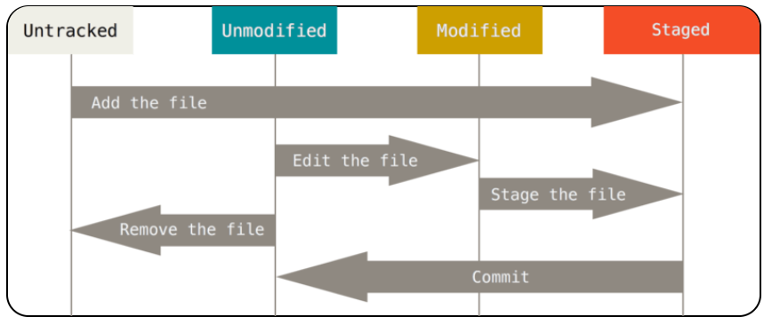

### 1、git的工作区域

git共有四个工作区域。

- 工作目录(workspace)：就是你平时存放的项目代码的地方
- 暂存区(Stage/Index)：暂存区就是用于临时存放你的改动，事实上它只是一个文件，保存即将提交到文件列表信息
- 资源库(Repository或Git Directory)：仓库区或者版本库，就是安全存放数据的位置，这里面有你提交到所有版本的数据。其中HEAD指向最新放入仓库的版本。
- git仓库(Remote Directory)：远程仓库，托管代码的服务器。


### 2、工作流程

git的工作流程一般是这样的：

-  在工作目录中添加、修改文件
-  将需要进行版本管理的文件放入暂存区域
- 将暂存区域的文件提交到git仓库

因此，git管理的文件有三种状态:已经修改(modified)，已暂存(stageg)，已提交(commoted)

### 3、文件的四种状态

版本控制就是对文件的版本控制，要对文件进行修改、提交等操作，首先腰肢到文件当前处于什么状态，不然就可能会提交了现在还不想提交的文件，或者要提交的文件没提交上。

> git不关心文件两个版本之间的具体差别，而是关心文件的整体是否有改变，若文件被改变，在添加提交时就生成文件新版本的快照，而判断文件整体是否改变的方法`SHA-1算法计算文件的校验和`。



从上图可以看出，共有四种状态：

`Untracked`：未跟踪，此文件已经在文件夹中，但并没有假如到git库，不参与版本控制。通过git add状态变为Staged

`Unmodify`：文件已经入库，未修改，即版本库中的文件快照内容与文件夹中完全一致。这种类型的文件有两种去处：

​			如果它被修改，而变为Modified.

​			如果使用git rm移出版本库，则成为Untracked文件。

`Modified`：文件已经修改，仅仅是修改，并借由进行其他的操作，这个文件也有两个去处，通过git add可进入暂存staged状态，使用git checkedout则丢弃修改过。

`Staged`：暂存状态，执行git conmit则将修改同步到库中，这时候库中的文件和本地文件变为一致，文件为Unmodify状态，执行git rest HEAD filename取消暂存，文件状态为Modified。


新建文件--->Untracked

使用add命令将新建的文件加入到暂存区--->Staged

使用commit命令将暂存区的文件提交到本地仓库--->Unmodified

如果对Unmodified状态的文件进行修改---> modified

如果对Unmodified状态的文件进行remove操作--->Untracked

### 4、git常用命令

#### 4.1 新建代码库

`1、在当前目录新建一个Git代码库`

```shell
git init
```

`2、新建一个目录，将其初始化为Git代码库`

  ```shell
git init [项目名称]
  ```

`3、下载一个项目和它的整个代码历史`

```shell
git clone [url]
```

#### 4.2 git配置

git的的设置文件为`.gitconfig`文件，它可以在用户的主目录下(相当于全局配置)，也可以在项目目录下(项目配置)。

`1、显示当前的Git配置`

```shell
git config --list
```

`2、编辑git配置文件`

```shell
git config -e [--global]
```

`3、设置提交代码时的用户信息`

```shell
git config [--global] user.name "[name]"
git config [--global] user.email "[email address]"
```

#### 4.3 增加/删除文件

`1、添加指定文件到暂存区`

```shell
git add [file1] [file2]...
```

`2、添加指定目录到暂存区，包括子目录`

```shell
git add [dir]
```

`3、添加当前目录的所有文件到暂存区`

```shell
git add .
```

`4、添加每个变化前，都会要求确认。对于同一个文件的多处变化，可以实现分次提交`

```shell
git add -p
```

`5、删除工作区文件，并且将这次删除放入暂存区`

```shell
git rm [file1] [file2]...
```

`6、停止追踪指定文件，但该文件会保留在工作区`

```shell
git rm  --cached [file]
```

`7、改名文件，并且将这个改名放入暂存区`

```shell
git mv [file-original(要改名的文件)] [file-renamed(要修改的名字)]
```

#### 4.4 代码提交

`1、提交到暂存区到仓库区`‘

```shell
git commit -m [message]
```

`2、提交暂存区的指定文件到仓库区`

```shell
git commit [file1][file2]...-m[message]
```

`3、提交工作区自上次commit之后的变化，直接到仓库区`

```shell
git commit -a
```

`4、提交时显示所有的diff信息`

```shell
git commit -v
```

`5、使用一次新的commit，替代上次提交，如果代码没有任何新变化，则用来改写上一次的commit的提交信息`

```shell
git commit -amend -m[message]
```

`6、重做上一次的commit,并包括指定文件的新变化`

```shell
git commit --amend [file1][file2]...
```

#### 4.5 分支操作

`1、列出所有的本地分支`

```shell
git branch
```

`2、列出所有的远程分支`

```shell
git branch -r
```

`3、列出所有本地分支和远程分支`

```shell
git branch -a
```

`4、新建一个分支，但依然停留在当前分支`

```shell
git branch [branch-name]
```

`5、新建一个分支，并切换到该分支`

```shell
git checkout -b [branch]
```

`6、新建一个分支，并指向指定commit`

```shell
git branch [branch] [commit]
```

`7、新建一个分支，与指定的远程分支建立追踪关系`

```shell
git branch --track [branch] [remote-branch(远程分支)]
```

`8、切换到指定分支，并且更新工作区`

```shell
git checkout [branch-name]
```

`9、切换到上一个分支`

```shell
git checkout -
```

`10、建立追踪关系，在现有分支与指定的远程分支之间`

```shell
git branch --set-upstrem [branch] [remote-branch]
```

`11、合并指定分支到当前分支`

```shell
git merage [branch]
```

`12、选择一个commit，合并进当前分支`

```shell
git cherry-pick [commit]
```

`13、删除分支`

```shell
git branch -d [branch-name]
```

`14、删除远程分支`

```shell
git push origin --delete [branch-name]
git branch -dr [remote/branch]
```

#### 4.6 标签操作

`1、列出所有tag`

```shell
git tag
```

`2、新建一个tag在当前commit`

```shell
git tag [tag]
```

`3、新建一个tag在指定commit`

```shell
git tag [tag] [commit]
```

`4、删除本地tag`

```shell
git tag -d [tag]
```

`5、删除远程tag`

```shell
git push origin :redfs/tags/[tagName]
```

`6、查看tag信息`

```shell
git show [tag]
```

`7、提交指定tag`

```shell
git push [remote] [tag]
```

`8、提交所有tag`

```shell
git push [remote] --tags
```

`9、新建一个分支，指向某个tag`

```shell
git checkout -b[branch][tag]
```

#### 4.7 查看信息

`1、显示有变更的文件`

```shell
git status
```

`2、显示当前分支的版本历史`

```shell
git log
```

`3、显示commit历史，以及每次commit发生变更的文件`

```shell
git log --stat
```

`4、根据关键词，搜索提交历史`

```shell
git log -S [keyword]
```

`5、显示某个commit之后所有变动，每个commit占据一行`

```shell
git log [tag] HEAD --pretty=format:%s
```

`6、显示某个commit之后所有变动,其提交说明必须符合搜索条件`

```shell
git log[tag]HEAD --grep featrue
```

`7、显示某个文件的版本历史，包括文件改名`

```shell
git log --follow [file]
git whatchanged[file]
```

`8、显示指定文件的相关的每一次diff`

```shell
git log -p [file]
```

`9、显示过去的5次提交`

```shell
git log -5 --pretty -oneline
```

`10、显示所有提交过的用户,按提交次数排序`

```shell
git shortlog -sn
```

`11、显示指定文件是什么人在什么时间修改过`

```shell
git blame [file]
```

`12、显示暂存区和上一个commit的差异`

```shell
git diff --cached[file]
```

`13、显示工作区和当前分支最新commit之间的差异`

```shell
git diff HEAD
```

`14、显示两次提交之间的差异`

```shell
git diff [first-branch]...[second-branch]
```

`15、显示今天写了多少行代码`

```shell
git diff --shortstat "@{0 day ago}"
```

`16、显示某次提交的元数据和内容变化`

```shell
git show [commit]
```

`17、显示某次提交发生变化的文件`

```shell
git show --name-only [commit]
```

`18、显示当前分支的最近几次提交`

```shell
git reflog
```


