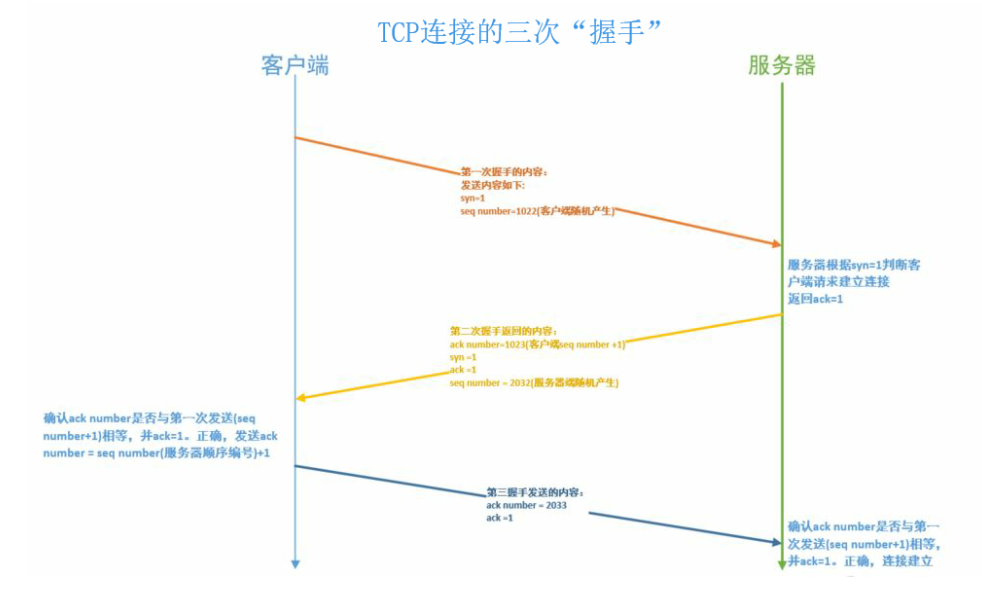

### 1、前端需要注意哪些SEO

- 合理的`title`，`description`、`keywords`:搜索对这三项的权重按顺序逐渐减小。
    - `title`强调重点，重要关键词不要出现2次，而且要靠前，不同页面的`title`要有所不同
    - `description`把页面内容高度概括，长度合适，不可过分堆砌关键词，不同页面的`description`要有所不同
    - `keywords`列举出重要关键词就可以了。
- 使用语义化的HTML代码，这样做更符合W3C规范，而且语义化的H5标签更容易被搜索引擎所理解
- 将重要的HTML标签放到前面，搜索引擎是从上到下，有的搜索引擎对抓取长度有限制，为保证重要内容一定会被抓取，所以尽可能将重要的标签内容放到前面。
- 重要的内容不要用JS输出，爬虫不会执行JS获取内容
- 少用或者不用iframe：搜索引擎不会抓取iframe中的内容
- 非装饰性的图片必须加alt
- 提高网站速度：网站速度是搜索引擎排序的一个重要指标

### 3、HTTP的几种请求方法

- GET：发送一个请求来获取服务器上的某一个资源
- POST：向服务器提交数据，相当于创建
- PUT：PUT指定了资源在服务器上的位置，局部更新页面
- HEAD：只请求页面的头部
- DELETE：删除服务器上的某资源
- OPTIONS：它用于获取当前URL所支持的方法，请求成功的话，就会在HTTP头中包含一个名为"Allow"的头，这个头的值就是所支持的主要是用来检查请求方式的。
- TRACE：被用于激发一个远程的，应用层的请求消息回路
- CONNECT   把请求连接转换到透明TCP/IP通道

### 4、从浏览器地址栏输入url到显示页面的步骤

- 浏览器首先会去缓存中查看请求资源是否存在以及是否过期，如果存在，且没有过期的话，会直接跳到转码步骤
- 如果缓存中不存在该请求资源，或者已经过期，那么浏览器就会重新解析该URL，获取协议，主机，端口，path等
- 浏览器组装一个HTTP请求报文
- 然后去获取该主机的ip地址，浏览器获取ip地址的过程如下：
    - 浏览器缓存
    - 本机缓存
    - hosts文件
    - 路由器缓存
    - DNS缓存
    - DNS递归查询
- 获取到ip地址后，浏览器会打开一个socket与目标地址，建立TCP连接，进行三次握手。
- TCP连接建立之后，就会发送HTTP请求
- 服务器接收请求，并且解析，将这个请求转发到服务程序
- 服务器会去检查HTTP请求头是否包含缓存验证信息，如果验证缓存存在且未过期，就会返回304等对应的一些状态码
- 处理程序读取完整请求，做完对应操作，准备好相应的返回数据后，就会准备好一个HTTP响应报文通过TCP连接发送回浏览器
- 浏览器接收到HTTP响应，可以根据情况选择关闭TCP连接或者是保留重用。关闭TCP连接会进行四次挥手
- 浏览器回去检查响应状态码，然后判断资源是否可以缓存，如果可以缓存的话，就去进行缓存，
- 然后对响应进行解码操作
- 根据资源类型的不同决定如何处理
- 然后就是解析HTML文档，构建DOM树，下载资源，构造CSSOM树，执行js脚本

### 5、如何进行网站性能优化


- Content方面
    - 减少HTTP请求：合并文件，CSS精灵图
    - 减少DNS查询：使用DNS缓存，并且将资源分布到恰当数量的主机上
    - 减少DOM元素数量
- Server方面
    - 使用CDN
    - 配置ETag
    - 对组件使用GZip压缩
- 减少Cookie的大小
- Css
    - 将样式表放到页面的顶部
    - 不要使用css表达式
    - 使用link不要使用@import
- js
    - 将脚本放到页面底部
    - 压缩外部引入的js和css代码
    - 删除不需要的脚本
    - 减少DOM访问
- 图片
    - 优化图片
    - 优化css精灵
    - HTML中拉伸图片

### 6、你用过哪些前端性能优化的方法

- 减少http请求次数：CSS Sprites, JS、CSS源码压缩、图片大小控制合适；网页Gzip，CDN托管，data缓存 ，图片服务器。
- 前端模板 JS+数据，减少由于HTML标签导致的带宽浪费，前端用变量保存AJAX请求结果，每次操作本地变量，不用请求，减少请求次数
- 用innerHTML代替DOM操作，减少DOM操作次数，优化javascript性能。
- 当需要设置的样式很多时设置className而不是直接操作style
- 少用全局变量、缓存DOM节点查找的结果。减少IO读取操作
- 避免使用CSS Expression（css表达式)又称Dynamic properties(动态属性)
- 图片预加载，将样式表放在顶部，将脚本放在底部 加上时间戳
- 避免在页面的主体布局中使用table，table要等其中的内容完全下载之后才会显示出来，显示比div+css布局慢


### 7、浏览器的三次握手和四次挥手

 三次握手指的是建立在TCP连接时，需要Client和Server需要进行三次信息确认。

`第一次握手`:建立连接，client发送连接请求SYN报文段到服务器后，进入syn_sent状态，请求建立连接，等待服务器确认

`第二次握手`:server端收到client端的syn包，必须确认客户端的syn(ack=j+1)，同时自身也发送一个syn包(syn=k)，即syn+ack包，此时服务器进入syn_recv状态

`第三次握手`：客户端收到服务器的syn+ack包，向服务器发送确认包ACK，此确认包发送完毕后，客户端和服务器进入一个TCP连接成功的状态，完成三次握手。

三次握手完成连接成功后，客户端和服务器之间就可以进行通信，数据传递等操作。



**为什么是三次握手，不是两次或者四次**

通过三次握手，A能知道B可以接受也可以发送信息，B也知道了A可以接受信息和发送信息，通信连接至此建立。三次连接时可以保证可靠的最小握手次数，再多握手也不能提高通信成功的概率，反而是浪费资源。

`TCP断开连接四次挥手`：

`第一次挥手`：当主机A的应用程序通知TCP数据已经发送完毕时，TCP向主机B发送一个带有FIN附加标记的报文段

`第二次挥手`：主机B收到这个FIN报文段的时候，并不会立即用FIN报文段回复主机A，而是先向主机A发送一个确认序号ACK，同时通知自己相应的应用程序：对方要求关闭连接(发送ACK的目的是为了防止在这段时间内，对方重传FIN报文段)

`第三次挥手`：主机B的应用程序告诉TCP：我要彻底关闭连接，TCP向主机A发送一个FIN报文段

`第四次挥手`：主机A收到这个FIN报文段之后，向主机B发送一个ACK表示连接彻底释放

为什么连接的时候是三次握手，关闭的时候却需要四次握手？

因为当服务端收到客户端客户端的SYN连接请求报文后，可以直接发送SYN+ACK报文。其中ACK报文是用来应答的，SYN报文是用来同步的。但是关闭连接时，当Server端收到FIN报文时，很可能并不会关闭Socket，所以先回复一个ACK报文，告诉Client端：你发的FIN报文我收到了。只有等到我Server端所有的报文都发送完了，我才能发送FIN报文，因此不能一起发送。故需要四步握手。

### 8、HTTP状态码

- 1xx：代表的是信息状态码
  
- 100 Continue继续  一般在发送post请求后，已经发送了http  header之后服务端将返回此信息表示确认，之后发送具体参数信息。
  
- 2xx：成功状态码
    - 200 ok正常返回信息
    - 201 Created  请求成功并且服务器创建了新的资源
    - 202 Accepted 服务器已接受了请求  但尚未处理
- 3xx:重定向
    - 301 Moved Permanently  请求的网页已经永久移动到新位置
    - 302 Found 临时重定向
    - 303 See  Other 临时性重定向而且总是使用GET请求信的URL
    - 304 Not Modified 自从上次请求后，请求的网页未修改过
- 4xx 客户端错误
    - 400	Bad Request 服务器无法理解请求的格式 客户端不应当尝试再次使用相同的内容发送请求
    - 401   请求未授权
    - 403   禁止访问
    - 404   找不到与URL匹配的资源
- 5xx 服务端错误
    - 500  最常见的服务端错误
    - 503 服务端暂时无法处理请求

	### 9、语义化的理解

- 用正确的标签做正确的事情
- HTML语义化就是让页面的内容结构化，便于浏览器和搜索引擎解析
- 在没有样式的情况下，也能一种文档格式显示，并且是易于阅读的
- 搜索引擎的爬虫依赖标记来确定上下文和各个关键字的权重，利于SEO

### 9、浏览器内核

- 浏览器内核主要分为渲染引擎和JS解析引擎
- 渲染引擎主要负责取得网页的内容，处理一些CSS样式问题，以及计算计算网页的显示方式。不同的浏览器内核对于网页的渲染会有所不同，所以最终渲染出来的效果也不相同。
- JS解析引擎就是用来解析和执行js来实现网页的动态效果的

常见的浏览器内核有哪些？

- Trident:IE
- Gecko:火狐
- Presto：Opera7
- Webkit：谷歌的chrome 苹果的Safari

### 10、H5的离线存储

离线存储是为了让用户可以在没有网络的状态下，也能够正常访问某些站点，当能够正常联网的时候，更新用户本地上的缓存文件。

原理：H5的离线存储是基于一个新建的.appcache文件的缓存机制来实现的，通过这个文件上的解析清单离线存储资源，这些资源就会像cookie一样被存储下来，之后网络处理离线状态时，浏览器会通过被离线存储的数据进行页面的展示

如何使用：

​		在页面头部的下面加入一个manifest属性

​		在cache.manifest文件的编写离线存储的资源

​		在离线状态下，操作window.applicationCache进行需求实现

```json
CACHE MANIFEST
#v0.11
CACHE:
js/app.js
css/style.css
NETWORK:
resourse/logo.png
FALLBACK:
/offline.html
```

管理：

​	在线的情况下，浏览器发先html头部有manifest属性，它会请求manifest文件，如果是第一次访问app，那么浏览器就会根据manifest文件的内容下载相应的资源并且离线存储，如果已经访问过app且资源已经离线存储了，那么浏览器就会使用离线的资源加载页面，然后浏览器就会对比新的manifest文件与旧的manifest文件，如果文件没有发生改变，就不做任何操作。如果文件改变了，那么就会重新下载文件中的资源并进行离线存储。

离线的情况下，浏览器就直接使用离线存储的资源。

### 11、cookie、sessionStorage、localStorage的区别

- cookie是网站为了标示用户身份而储存在用户本地终端上的数据
- cookie数据始终在同源的http请求中携带，记会在浏览器和服务器间来回传递
- sessionStorage和localStorage不会自动把数据发给服务器，仅仅在本地保存
- 存储大小：
    - cookie数据大小不能超过4k
    - sessionStorage和localStroage，虽然也有大小的限制，但是比cookie要大的多，可以达到5M或者更大。
- 过期时间：
    - localStorage存储持久数据，浏览器关闭后数据不丢失除非主动删除数据
    - sessionStorage 数据在当前浏览器窗口关闭后自动删除
    - cookIe设置的cookie过期时间之前一直有效，即使窗口或者浏览器关闭。

### 12、iframe有哪些缺点

iframe会阻塞主页面的Onload事件

搜索引擎的检索程序无法解读这种页面，不利于SEO

iframe和主页面共享连接池，而浏览器对相同域的连接有限制，所以会影响页面的并行加载

使用iframe之前需要考虑这两个缺点，如果需要使用iframe，最好是通过js动态给ifame添加src属性值，这样可以绕开以上两个问题。

### 13、Doctype作用 严格与混杂模式如何区分？有何意义

- 页面被加载时，link会同时被加载，而@import页面被加载时，link会同时被加载，而@import引用的CSS会等到页面被加载完加载import只在IE5以上才能识别，而link是XHTML标签，无兼容问题link方式的样式的权重高于@import的权重
- `<!DOCTYPE>`声明位于文档中的最前面，处于html标签之前，告知浏览器的解析器，用什么文档类型规范来解析这个文档。
- 严格模式的排版和JS运行模式是以该浏览器支持的最高标准运行
- 在混杂模式中，页面的宽松的向后兼容的方式显示，模拟老式浏览的行为以防止站点无法工作 `DOCTYPE`不存在或格式 不正确会导致文档以混杂模式呈现


### 14、为什么利用多个域名来存储网站资源更有效？

- CDN缓存更方便
- 突破浏览器并发限制
- 节约cookie带宽
- 节约主域名的连接数 优化页面响应速度
- 防止不必要的安全问题

### 15、web开发中会话跟踪的方法有哪些

- `cookie`
- `session`
- `url`重写
- 隐藏`input`
- `ip`地址

### 16、HTTP request报文结构是怎样的

1. 首行是**Request-Line**包括：**请求方法**，**请求URI**，**协议版本**，**CRLF**
2. 首行之后是若干行**请求头**，包括**general-header**，**request-header**或者**entity-header**，每个一行以CRLF结束
3. 请求头和消息实体之间有一个**CRLF分隔**
4. 根据实际请求需要可能包含一个**消息实体** 一个请求报文例子如下：

```
GET /Protocols/rfc2616/rfc2616-sec5.html HTTP/1.1
Host: www.w3.org
Connection: keep-alive
Cache-Control: max-age=0
Accept: text/html,application/xhtml+xml,application/xml;q=0.9,image/webp,*/*;q=0.8
User-Agent: Mozilla/5.0 (Windows NT 6.1; WOW64) AppleWebKit/537.36 (KHTML, like Gecko) Chrome/35.0.1916.153 Safari/537.36
Referer: https://www.google.com.hk/
Accept-Encoding: gzip,deflate,sdch
Accept-Language: zh-CN,zh;q=0.8,en;q=0.6
Cookie: authorstyle=yes
If-None-Match: "2cc8-3e3073913b100"
If-Modified-Since: Wed, 01 Sep 2004 13:24:52 GMT

name=qiu&age=25
```

### 17、HTTP response报文结构是怎样的

- 首行是状态行包括：**HTTP版本，状态码，状态描述**，后面跟一个CRLF
- 首行之后是**若干行响应头**，包括：**通用头部，响应头部，实体头部**
- 响应头部和响应实体之间用**一个CRLF空行**分隔
- 最后是一个可能的**消息实体** 响应报文例子如下：

```
HTTP/1.1 200 OK
Date: Tue, 08 Jul 2014 05:28:43 GMT
Server: Apache/2
Last-Modified: Wed, 01 Sep 2004 13:24:52 GMT
ETag: "40d7-3e3073913b100"
Accept-Ranges: bytes
Content-Length: 16599
Cache-Control: max-age=21600
Expires: Tue, 08 Jul 2014 11:28:43 GMT
P3P: policyref="http://www.w3.org/2001/05/P3P/p3p.xml"
Content-Type: text/html; charset=iso-8859-1

{"name": "qiu", "age": 25}
```

### 18、请你谈谈Cookie的弊端

- 每个特定的域名下最多生成`20`个`cookie`
- `IE6`或更低版本最多`20`个`cookie`
- `IE7`和之后的版本最后可以有`50`个`cookie`
- `Firefox`最多50个`cookie`
- `chrome`和`Safari`没有做硬性限制
- IE 和 Opera 会清理近期最少使用的 `cookie`，`Firefox` 会随机清理 `cookie`
- `cookie` 的最大大约为 `4096` 字节，为了兼容性，一般设置不超过 `4095` 字节
- 如果 `cookie` 被人拦截了，就可以取得所有的 `session` 信息